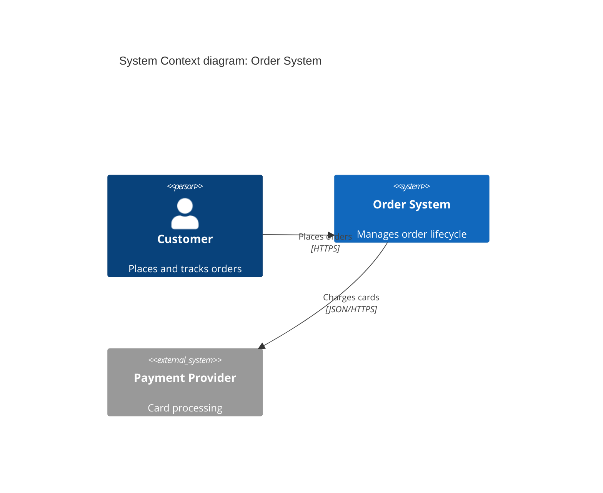
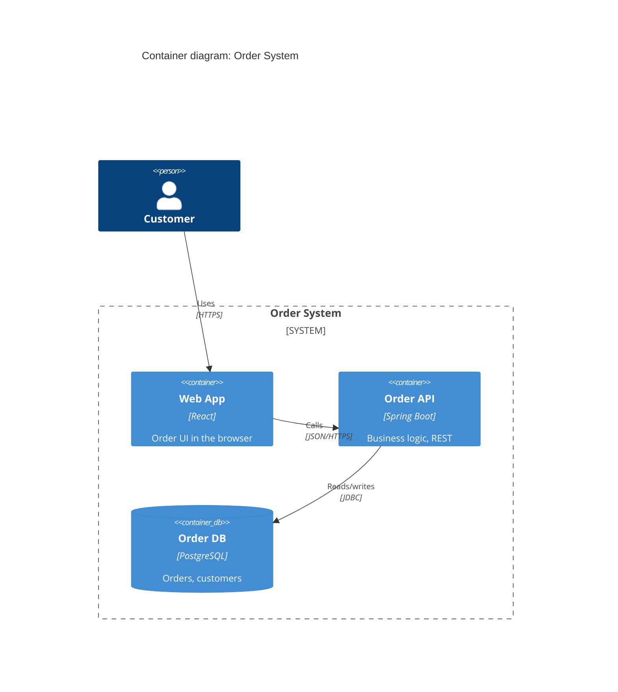
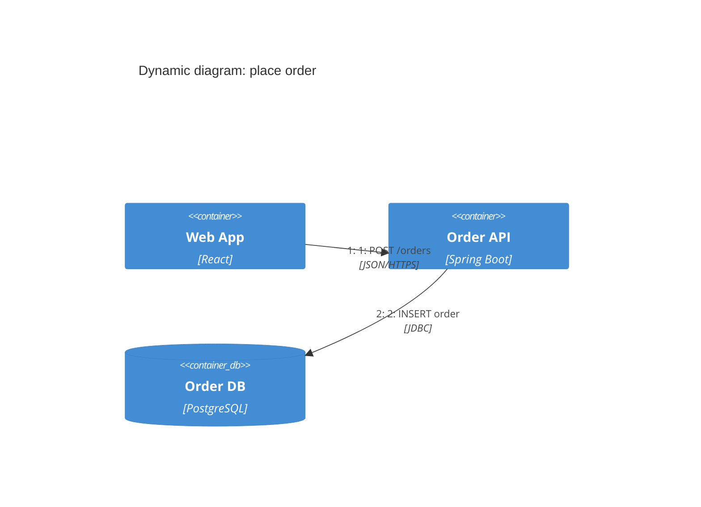
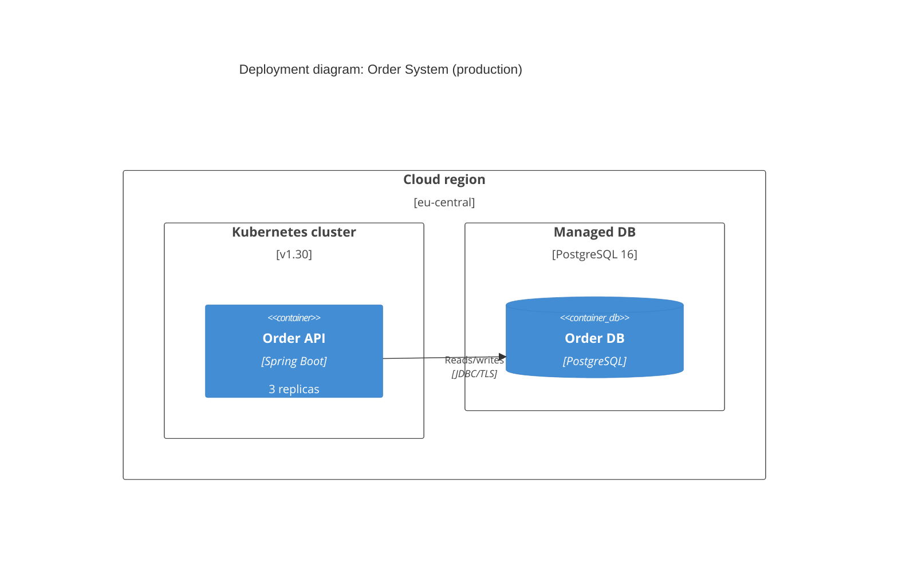

# Embedding C4 views in an arc42 document

Sources: C4 model, https://c4model.com/ (unversioned living site); Mermaid
C4 syntax, https://mermaid.js.org/syntax/c4.html (experimental). Both
verified 2026-07-06. Distilled for offline use.

For full diagram craft (layout, styling, larger examples, flowchart
fallback details) the sibling skill `c4-diagrammer` is the owner; this
file carries only what an architecture DOCUMENT needs.

## Which C4 view goes in which arc42 section

| arc42 section | C4 view | Abstraction shown |
|---|---|---|
| 3. Context and Scope | System Context | The system as ONE box + people + neighboring systems |
| 5.1 Building Block View L1 | Container | Deployable/runnable units inside the system |
| 5.2 Building Block View L2 | Component | Major structural parts inside ONE container |
| 6. Runtime View | Dynamic (or sequence) | Order of interactions for one scenario |
| 7. Deployment View | Deployment | Infrastructure nodes and what runs where |

Rule of one level: never mix abstraction levels in a single diagram
(no components floating next to whole systems). C4 is notation- and
tooling-independent; the levels are the normative part.

## Diagram hygiene (applies to every embedded diagram)

- Title: "<View type> diagram: <system/scope>".
- Every element: name + short description; containers and components
  additionally carry a technology label ("Spring Boot service",
  "PostgreSQL 16").
- Every relationship: a verb phrase ("reads inventory from", not a bare
  line), plus protocol where it matters ("JSON/HTTPS").
- Prefer few elements: if a diagram needs more than ~15-20 boxes, split
  the scope or drop detail a level down.

## Mermaid patterns (render offline in VS Code / GitHub)

Mermaid's C4 syntax is EXPERIMENTAL ("syntax and properties can change in
future releases" — mermaid.js.org). It renders in current VS Code Markdown
preview and GitHub. If a target renderer rejects `C4Context`, fall back to
Mermaid `flowchart` with the conventions in the c4-diagrammer skill.

System context (arc42 section 3):

Container (arc42 section 5.1):

Dynamic (arc42 section 6) — or use a plain Mermaid `sequenceDiagram`,
which is stable, when step ordering is the whole point:

Deployment (arc42 section 7):

Mermaid C4 does not support auto-legends; add a one-line caption under
each diagram naming the element types and any color meaning, e.g.
"Boxes: containers within the Order System boundary; grey: external."
