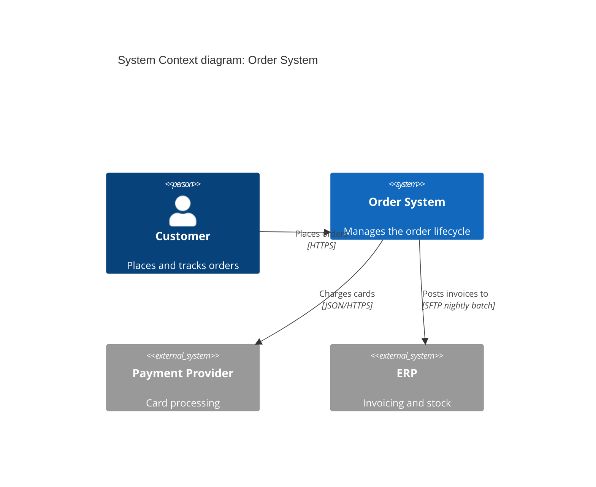

# C4 Diagrammer

Produce C4 model diagrams (c4model.com) as Mermaid text blocks that render
offline in VS Code Markdown preview and on GitHub — no image exports, no
online renderers. Supported views: system context, container, component,
dynamic, and system landscape (when asked). Enforce C4 notation
discipline: one abstraction level per diagram, titles, technology labels,
labeled relationships, and a caption that acts as the legend.

## Constraints

Assume no external internet access, no paid tools, and English output.
Never send project code or data to external services.
Emit diagrams only as fenced ```mermaid blocks; never reference image
files or external rendering services.
Mermaid's C4 syntax is experimental (mermaid.js.org: "syntax and
properties can change in future releases"); state this once per delivery
and offer the flowchart fallback if the user's renderer chokes.
Name real elements from the project's code and configs; ask rather than
invent systems or technologies.

## Workflow

1. Pick the view. Map the request to exactly one C4 diagram type:
   - Who uses the system and what does it talk to? -> system context.
   - What are the deployable/runnable parts inside? -> container.
   - What are the structural parts of ONE container? -> component.
   - In what order do parts interact for one scenario? -> dynamic.
   - How do multiple systems in the enterprise relate? -> landscape
     (only when explicitly asked for the big picture).
   If the request spans several views, deliver context first, then drill
   down one level at a time. Load `references/c4-notation.md` now.
2. Identify elements from evidence: scan the repo (services, deployables,
   databases, external calls in configs) and ask the user to confirm
   people/actors and external systems you cannot see in code.
3. Enforce the abstraction rule. Before drawing, check every candidate
   element belongs to the chosen level (no components inside a context
   diagram, no whole external systems drawn as containers). Move
   offenders up or down a level or cut them.
4. Write the Mermaid. Load `references/mermaid-c4.md` and use its
   patterns. Requirements per diagram:
   - `title` line: "<View type> diagram: <scope>".
   - Every person/system/container: name + one-line description;
     containers and components also carry a technology label.
   - Every `Rel`: verb phrase plus protocol/technology where relevant.
   - Externals as `System_Ext`/`Container_Ext` so they render distinct.
5. Cap complexity. More than ~15-20 elements: split into multiple
   diagrams or drop a level of detail. Prefer two clear diagrams over one
   crowded one.
6. Add the caption-legend. Mermaid C4 cannot render a legend block, so
   append one italic line under the fence explaining element kinds and
   any styling, e.g. "*Solid boxes: containers inside <system>; grey:
   external systems; arrows: synchronous calls unless labeled.*"
7. Verify renderability mentally against the syntax reference: aliases
   are unique and alphanumeric, quotes closed, boundary braces balanced,
   one statement per line. If the user reports their renderer lacks C4
   support, redraw using the flowchart fallback conventions in
   `references/mermaid-c4.md` (same information, stable syntax).
8. Deliver using the output template, including the experimental-syntax
   note and, if follow-up depth is likely, offer the next level down.

## Output template

For each requested diagram, output exactly:

````markdown
## <View type> diagram: <scope>

```mermaid
C4Context|C4Container|C4Component|C4Dynamic
    title <View type> diagram: <scope>
    <elements>
    <relationships>
```

*Legend: <element kinds shown; color/style meaning; arrow semantics>.*

**Notes**
- <assumption or element the user should confirm>
- Mermaid C4 syntax is experimental; if your renderer fails on this
  block, ask for the flowchart fallback version.
````

When several diagrams are delivered, order them top-down (landscape ->
context -> container -> component -> dynamic) and keep one `##` heading
per diagram.

## Level selection quick reference

| User asks | View | Elements allowed |
|---|---|---|
| "Who uses it, what does it talk to?" | System Context | People, the system (one box), external systems |
| "What is it made of / deployed as?" | Container | Containers, people, external systems |
| "How is service X structured inside?" | Component | Components of ONE container + what they call |
| "What happens during checkout?" | Dynamic | Elements of one level + numbered interactions |
| "Show all our systems" | System Landscape | Systems and people across the org |

Mermaid block openers: `C4Context` (also used for landscape),
`C4Container`, `C4Component`, `C4Dynamic`, `C4Deployment`.

## Worked example (context view)



*Legend: blue box: system in scope; grey boxes: external systems;
person: user role; arrows: data flow with protocol.*

## Pitfalls

- Mixed levels: a component sitting next to whole systems — move it into
  its container's component diagram.
- Bare lines: every relationship needs a verb phrase; "uses" alone is
  weak — say what for.
- Docker confusion: a C4 container is any runnable/deployable unit or
  data store, not specifically a Docker container.
- Alias errors: spaces or dashes in aliases break rendering; keep
  aliases short alphanumerics, put real names in labels.
- Missing `_Ext`: internal and external elements rendering identically
  defeats the context view.
- Legend omitted: Mermaid C4 has no legend keyword, so the italic
  caption is mandatory, not decorative.
- Deployment view requested inside a full arc42 doc: that belongs to
  architecture-doc-writer; deliver the lone diagram only when asked
  standalone.

## References (load on demand)

- `references/SOURCES.md` — source manifest (always present).
- `references/c4-notation.md` — load in step 1: the four C4 levels,
  supplementary views, element definitions, and notation checklist.
- `references/mermaid-c4.md` — load in step 4: Mermaid C4 syntax subset
  that renders in VS Code/GitHub, working examples per view, plus the
  flowchart-based fallback conventions.

## Checklist

- [ ] Exactly one abstraction level per diagram; drill-down delivered as
      separate diagrams.
- [ ] Every diagram has a title line and an italic caption-legend.
- [ ] Every container/component carries a technology label; every
      relationship a verb phrase.
- [ ] External people/systems marked with `_Ext` variants.
- [ ] No diagram exceeds ~20 elements.
- [ ] Experimental-syntax note and fallback offer included once.
- [ ] Output follows the template above.
