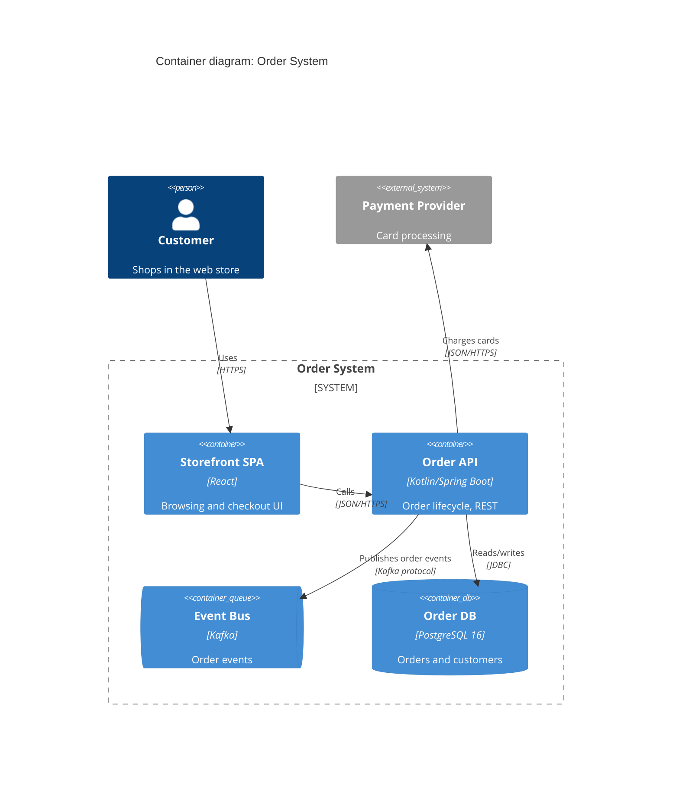
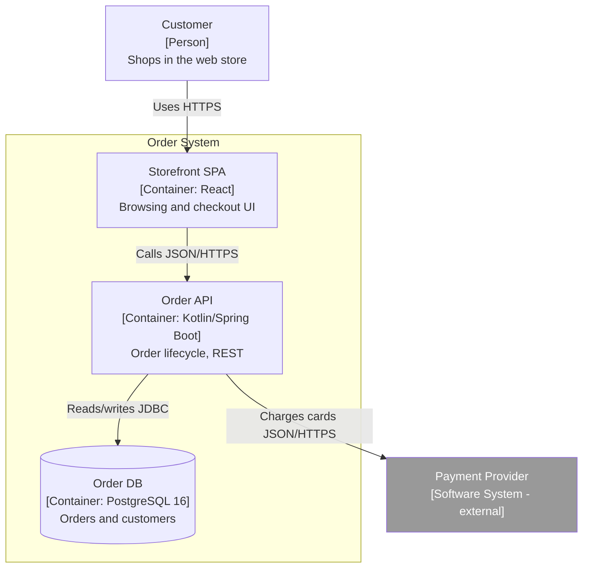

# Mermaid C4 syntax + stable flowchart fallback

Sources: Mermaid C4 page, https://mermaid.js.org/syntax/c4.html; Mermaid
flowchart page, https://mermaid.js.org/syntax/flowchart.html. Both
verified 2026-07-06. Distilled for offline use.

## Status: experimental

Mermaid's C4 support carries this upstream warning: "This is an
experimental diagram for now. The syntax and properties can change in
future releases." It renders today in VS Code Markdown preview and on
GitHub. Always mention this once per delivery; if a renderer rejects the
block, use the flowchart fallback at the bottom of this file.

Mermaid C4 follows C4-PlantUML conventions, but sprites, tags, links, and
legend blocks are NOT supported — hence the caption-legend rule.

## Diagram types

`C4Context`, `C4Container`, `C4Component`, `C4Dynamic`, `C4Deployment`.

## Element keywords

People and systems (context/landscape level):

- `Person(alias, "Label", "Description")` / `Person_Ext(...)`
- `System(alias, "Label", "Description")` / `System_Ext(...)`
- `SystemDb(...)`, `SystemQueue(...)` and their `_Ext` variants

Containers and components:

- `Container(alias, "Label", "Technology", "Description")`
- `ContainerDb(...)`, `ContainerQueue(...)`, plus `_Ext` variants
- `Component(alias, "Label", "Technology", "Description")`,
  `ComponentDb(...)`, `ComponentQueue(...)`, plus `_Ext` variants

Boundaries (curly-brace blocks):

- `Enterprise_Boundary(alias, "Label") { ... }`
- `System_Boundary(alias, "Label") { ... }`
- `Container_Boundary(alias, "Label") { ... }`
- `Boundary(alias, "Label", "type") { ... }` — generic

Deployment:

- `Deployment_Node(alias, "Label", "Technology") { ... }` (nestable)
- `Node(...)` as shorthand; `Node_L(...)`, `Node_R(...)` for placement

## Relationships

- `Rel(from, to, "Verb phrase", "Technology/Protocol")`
- `BiRel(from, to, "Label", "Tech")` — bidirectional
- `Rel_U/Rel_D/Rel_L/Rel_R(...)` — hint arrow direction
- `Rel_Back(...)` — reverse arrow
- `RelIndex(index, from, to, "Label")` — numbered steps (C4Dynamic)

## Styling and layout (optional; keep minimal)

- `UpdateElementStyle(alias, $bgColor="...", $fontColor="...", $borderColor="...")`
- `UpdateRelStyle(from, to, $textColor="...", $lineColor="...", $offsetX="n", $offsetY="n")`
- `UpdateLayoutConfig($c4ShapeInRow="3", $c4BoundaryInRow="1")` — wrap
  wide diagrams

## Gotchas

- Aliases: unique, alphanumeric (no spaces/dashes); labels carry the
  human-readable text.
- One statement per line; boundary `{` on the same line as the keyword.
- Quotes around every label/description; unbalanced quotes are the most
  common render failure.
- `title` is plain text on its own line (no quotes needed).
- No legend keyword exists — put the legend in an italic caption below
  the fence.

## Worked example (container view)

## Flowchart fallback (stable syntax, same information)

Use when a target renderer lacks C4 support. Conventions:

- `flowchart TB` (context/container/component) or a `sequenceDiagram`
  (dynamic scenarios).
- Node text carries the C4 metadata on separate lines:
  `api["Order API [Container: Kotlin/Spring Boot] Order lifecycle, REST"]`
  — always `Name`, `[Level: Technology]`, `Description`.
- `subgraph` = boundary: `subgraph sys["Order System"] ... end`.
- Edges labeled with verb + protocol: `spa -->|"Calls JSON/HTTPS"| api`.
- Style internal vs external with `classDef`:
  `classDef ext fill:#999999,color:#ffffff` and `class pay ext`.
- Databases may use the cylinder shape: `db[("Order DB [Container: PostgreSQL 16]")]`.
- Title: flowcharts have no title keyword — put the title in the `##`
  heading above the fence and keep the caption-legend line.

Fallback example (same system):

