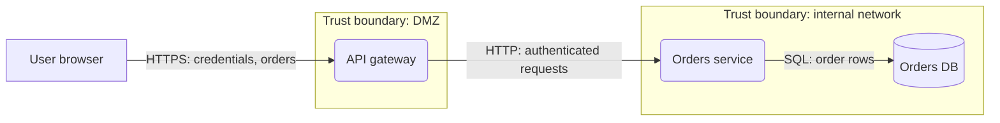

# Threat modeling process (distilled)

Sources: OWASP Threat Modeling Cheat Sheet
(https://cheatsheetseries.owasp.org/cheatsheets/Threat_Modeling_Cheat_Sheet.html)
and the Threat Modeling Manifesto (https://www.threatmodelingmanifesto.org/).
Both verified 2026-07-06. Risk matrix granularity is library guidance
[convention] consistent with the cheat sheet's qualitative likelihood/impact
ranking.

## The four questions (Manifesto / OWASP)

1. **What are we working on?** → system modeling / decomposition.
2. **What can go wrong?** → threat identification (STRIDE here).
3. **What are we going to do about it?** → responses and mitigations.
4. **Did we do a good enough job?** → review and validation.

Answer all four in every model. A threat list without responses, or
mitigations without a validation pass, is an incomplete model.

## Decomposition guidance (OWASP: system modeling)

- Model with a data flow diagram: external entities, processes, data
  stores, data flows, trust boundaries (element definitions in
  references/stride.md).
- Rules of thumb for a sensible DFD (MSDN, cited in stride.md):
  - No magic sources or sinks — every data store has a reader and a
    writer represented.
  - Data never moves without a process moving it.
  - Collapse similar elements inside one trust boundary into one element.
  - Model one side of a trust boundary in detail at a time; the other
    side is just external entities ("you don't trust what's on the other
    side").
- Iterate in manageable portions (Manifesto principle): model one
  subsystem or feature slice deeply rather than the whole estate shallowly.

## Mermaid diagram pattern

Represent trust boundaries as subgraphs; label flows with the data they
carry:

Conventions: `[...]` external entity, `(...)` process, `[(...)]` data
store, arrows are data flows, subgraphs are trust boundaries. A structured
text list of the same four element sets is an acceptable substitute when a
diagram adds nothing.

## Risk ranking [convention]

Score each threat qualitatively, then combine:

- **Likelihood** (High/Medium/Low): attacker skill and motivation needed,
  exposure of the element (internet-facing? authenticated? boundary-
  crossing?), presence of existing controls.
- **Impact** (High/Medium/Low): sensitivity of affected assets, blast
  radius, recoverability, legal/regulatory consequences.

| Likelihood \ Impact | High | Medium | Low |
|---|---|---|---|
| **High** | Critical | High | Medium |
| **Medium** | High | Medium | Low |
| **Low** | Medium | Low | Low |

Order the register by risk, highest first. If the team already uses a
scoring scheme (CVSS-like, DREAD, numeric), adopt theirs and say so.

## Responses (OWASP)

For every identified threat pick exactly one primary response:

| Response | Meaning | When |
|---|---|---|
| Mitigate | Add/strengthen a control that reduces likelihood or impact | Default choice |
| Eliminate | Remove the feature, flow, or data that carries the threat | When the risky part is not worth its value |
| Transfer | Shift risk to a component/party better placed to handle it | Gateway handles authN for all services; contractual transfer |
| Accept | Documented decision to take the risk | Low risk only; needs a written justification and an owner |

## Validation (question 4)

Confirm before finishing:
- Every element walked with its applicable STRIDE categories.
- Every trust-boundary crossing considered (or "none found" recorded).
- Every threat has a response; mitigations are concrete controls.
- Relevant stakeholders can act on the output (Manifesto: outcomes hold
  value when stakeholders find them meaningful).
- The model states its assumptions so it can be re-checked when the design
  changes (threat modeling is continuous, not a one-shot snapshot).

## Manifesto values, patterns, anti-patterns (apply while working)

Values: finding and fixing design issues over checkbox compliance; people
and collaboration over processes and tools; understanding over snapshots;
doing threat modeling over talking about it; continuous refinement over a
single delivery.

Patterns to follow: systematic approach (cover all elements, not just
interesting ones), informed creativity, varied viewpoints, theory into
practice.

Anti-patterns to avoid:
- **Hero threat modeler** — do not present the model as complete without
  team review; list open questions.
- **Admiration for the problem** — always move from threats to responses.
- **Tendency to overfocus** — do not spend the whole model on one exotic
  threat while boundary-crossing basics go unexamined.
- **Perfect representation** — a good-enough diagram that the team
  understands beats an exhaustive one nobody reads.
